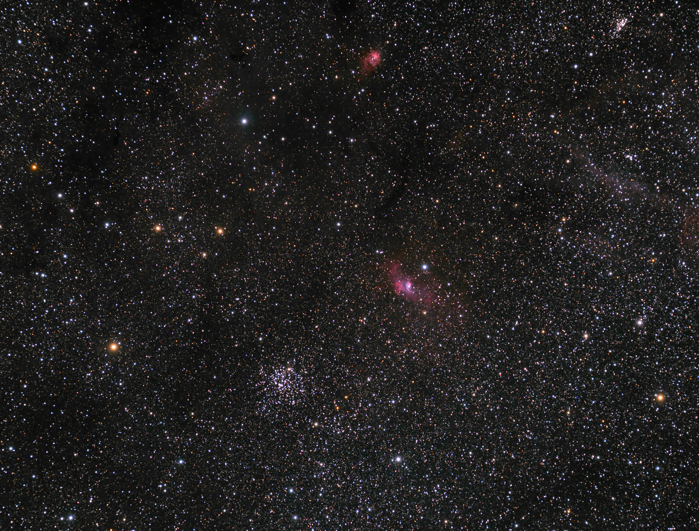

# NGC7635 - The Bubble Nebula and companions

Feel free to use or publish this material, modified or not.
The only condition is that the credit line include the phrase
"Image Acquisition by Guillaume Gimenez" with a link to this
repository.

# Processed with [DarkFlow](http://www.darkflow.org/).

Contains M 52 (NGC 7654), Bubble nebula (NGC 7635), NGC 7538, NGC 7510 and The star 4Cas

# Contribute

You can contribute to this repository, fork it, try
[DarkFlow](http://www.darkflow.org/) and make a pool request.
Your processing will be added in its dedicated branch. And the
best looking picture will be made the default branch.
